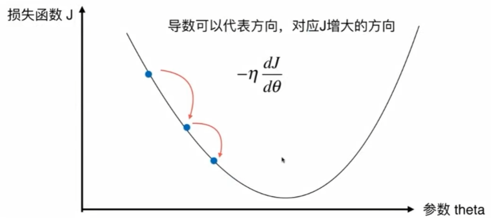
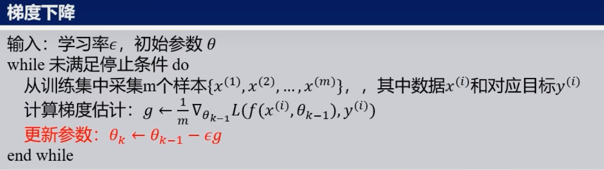
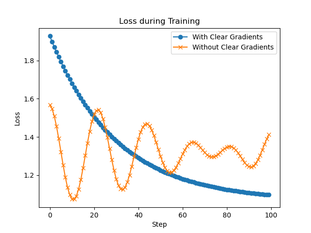
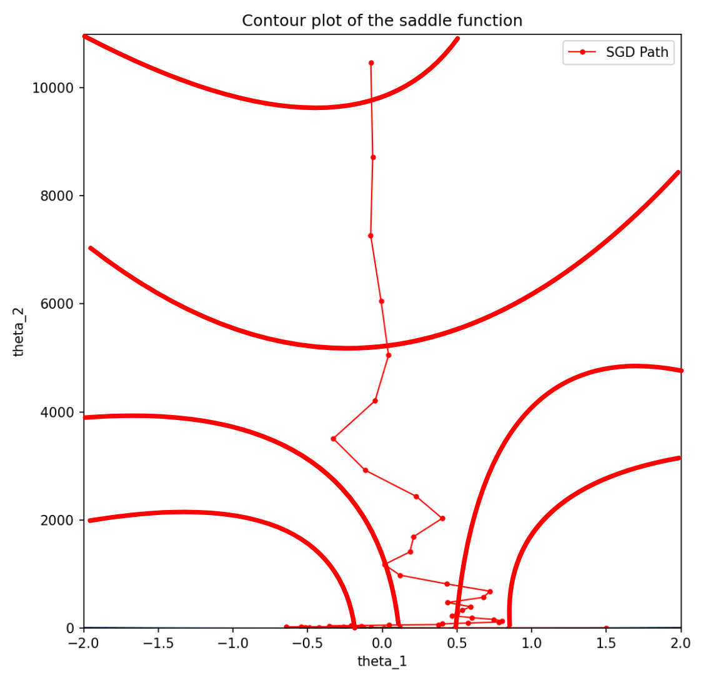
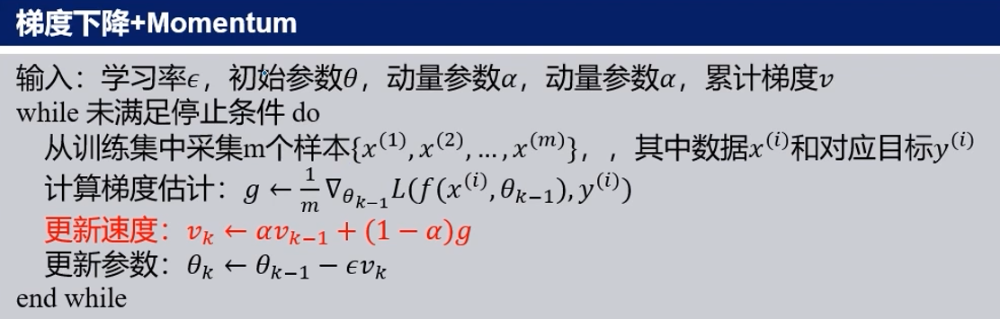
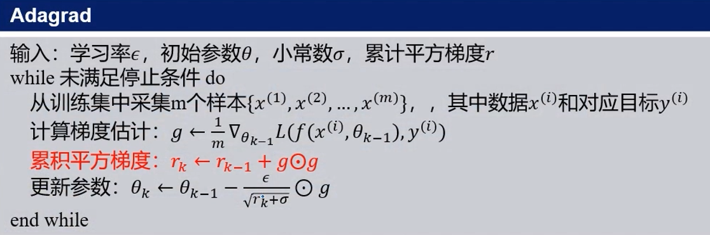
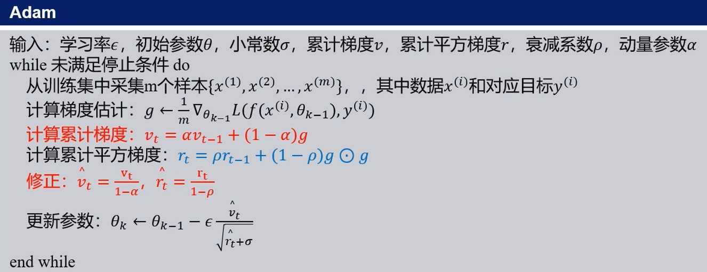

# 优化理论在深度学习中的应用

# 大纲

## 追本溯源

### 梯度下降

**早期数学基础**:

梯度下降法的基本思想源于微积分中的梯度概念. 梯度是多变量函数的方向导数, 表示函数在某点的最大上升方向.
19 世纪的数学家如卡尔·弗里德里希·高斯 (Carl Friedrich Gauss) 和奥古斯丁·路易斯·柯西 (Augustin-Louis
Cauchy) 在优化问题中已经使用了类似的思想.

**高斯牛顿法**:
高斯-牛顿法用于求解非线性最小二乘问题, 目标是最小化残差平方和. 算法的基本步骤包括:

1. 初始猜测参数值.
2. 计算残差和雅可比矩阵.
3. 使用线性近似来更新参数值.
4. 迭代上述步骤直到收敛.
   高斯-牛顿法的更新公式为：
   \[ \mathbf{x}_{k+1} = \mathbf{x}_k + \Delta \mathbf{x}_k \]
   其中，\(\Delta \mathbf{x}_k\) 是在第 \(k\) 次迭代时参数更新的增量，可以通过解下列线性方程组得到：
   \[ \mathbf{J}^T \mathbf{J} \Delta \mathbf{x}_k = -\mathbf{J}^T \mathbf{f}(\mathbf{x}_k) \]
   这里：

- \(\mathbf{J}\) 是目标函数关于参数的雅可比矩阵（Jacobian matrix）。
- \(\mathbf{f}(\mathbf{x}_k)\) 是在第 \(k\) 次迭代时目标函数的残差向量。
- \(\mathbf{x}_k\) 是在第 \(k\) 次迭代时的参数估计值。
- \(\mathbf{J}^T\) 是雅可比矩阵的转置。

高斯通过引入雅可比矩阵和线性近似的思想, 为后来的梯度下降法及其变体提供了重要的理论基础.
他的方法在求解非线性优化问题中发挥了重要作用.

**柯西梯度法**:
柯西在1847年提出了一种求解非线性方程的迭代方法, 这种方法后来被称为 "柯西梯度法"  (Cauchy Gradient
Method) , 也是梯度下降法的早期形式.

柯西梯度法的基本思想:
柯西梯度法旨在找到一个函数的局部极小值, 通过沿负梯度方向进行迭代来逐步逼近极小值点.

高斯和柯西的工作对优化理论的发展具有深远影响. 高斯通过高斯-牛顿法引入了雅可比矩阵和线性近似的概念,
为非线性优化问题提供了有效的解决方案. 而柯西通过柯西梯度法提出了沿梯度方向进行迭代的方法,
为梯度下降法奠定了基础.

## 其在人工智能中的应用

在深度学习算法中, 梯度下降 (Gradient Descent) 是一种用于优化和训练机器学习模型的迭代算法.
它通过逐步调整模型参数以最小化损失函数 (即模型预测与实际值之间的误差), 找到模型参数的最优值,
从而找到问题的一种解决方案.

### 背景

梯度下降的核心概念源于微积分, 特别是导数和梯度的定义. 导数表示函数变化的速率, 而梯度是多变量函数的方向导数,
表示函数在某一点的最陡上升方向. 通过沿着梯度的反方向行进, 模型可以逐渐找到问题的最优解. 随着计算技术的发展,
多变量优化问题变得越来越普遍, 普通的枚举以及基于规则的方法逐渐变得越来越低效率.
这些问题需要有效的优化算法来找到函数的最优值, 而梯度下降法提供了一种计算上可行的方法.
梯度下降算法的产生背景是多方面的, 包括数学理论的发展 / 计算需求的增加 / 计算机科学的进步 /
统计学和优化理论的推动以及实际应用的需求. 这些因素共同促成了梯度下降算法的形成和广泛应用.
梯度下降法及其变体如今已经成为机器学习和深度学习中不可或缺的工具, 极大地推动了人工智能技术的发展.

### 发展

[//]: # (
Attention: 这部分我打算展开讲, 毕竟这里能够尽情地放公式, 我打算每种梯度下降的优化器都介绍一下它的特点和公式,
以及推导过程.
)

从高斯的最小二乘法 / 柯西的柯西梯度法开始, 经过几十年, 上百年的研究, 梯度下降算法不断优化,
逐渐成为我们今天强大的工具, 下面我们来介绍一下常见的几种梯度下降的发展变体.

**最小二乘法**:
高斯最小二乘法是一种数学优化技术，它通过最小化误差的平方和来寻找数据的最佳函数匹配。这种方法在数据分析、曲线拟合、参数估计等领域有着广泛的应用。
最小二乘法的基本思想可以追溯到1801年，由德国数学家卡尔·弗里德里希·高斯（Carl Friedrich
Gauss）提出，用于解决天体测量中的问题。他在解决这个问题时，提出了最小化观测值与模型预测值之间差的平方和的方法，这就是最小二乘法。
**最小二乘法的数学原理**
假设我们有一组观测数据 $(x_1, y_1), (x_2, y_2), ..., (x_n, y_n)$，我们希望通过一个模型 $y = f(x,
\theta)$ 来拟合这些数据，其中 $\theta$ 是模型的参数。最小二乘法的目标是找到参数 $\theta$
的最佳估计值，使得观测值与模型预测值之间的差的平方和最小。
具体来说，我们需要最小化以下目标函数（残差平方和）：
$$
S(\theta) = \sum_{i=1}^{n} r_i^2 = \sum_{i=1}^{n} (y_i - f(x_i, \theta))^2
$$
其中，$r_i = y_i - f(x_i, \theta)$ 是第 $i$ 个观测值的残差。
为了找到使得 $S(\theta)$ 最小的 $\theta$，我们通常对 $S(\theta)$ 进行求导，并令导数等于零来求解
$\theta$。当模型是线性的，即 $f(x, \theta) = \theta_0 + \theta_1 x$ 时，这个方法就称为线性最小二乘法。
**最小二乘法的应用**
最小二乘法在科学研究和工程技术中有着广泛的应用，例如：

- **曲线拟合**：根据数据点拟合出一条曲线，用于预测未来的数据点。
- **回归分析**：在统计学中，用于建立自变量和因变量之间的线性关系。
- **信号处理**：在信号处理中，用于从噪声中提取信号。
- **图像处理**：在图像处理中，用于图像恢复和重建。

**最小二乘法的局限性**
尽管最小二乘法是一个非常强大的工具，但它也有一些局限性：

- 它假设误差是高斯分布的，且各个观测值的误差是独立的。
- 当数据中存在异常值时，最小二乘法对异常值非常敏感，可能会得到不准确的结果。
- 对于非线性模型，最小二乘法可能不适用，需要使用更复杂的方法。
  高斯最小二乘法是一个非常重要的数学工具，它为数据分析提供了一个强有力的框架，并在许多领域都有着重要的应用。

**柯西梯度法**:

柯西梯度法（Cauchy's Gradient
Method），也称为柯西-施瓦茨不等式法，是一种用于求解无约束优化问题的数值方法。这种方法属于一阶优化算法，因为它在每次迭代时只使用目标函数的一阶导数信息。柯西梯度法的特点是在每次迭代中，利用柯西-施瓦茨不等式来确定搜索方向和步长。
**柯西梯度法的原理**
柯西梯度法的迭代步骤通常如下：

1. **选择初始点**：选择一个初始点 $ x_0 $ 作为优化的起始点。
2. **计算梯度**：计算目标函数 $ f(x) $ 在当前点 $ x_k $ 处的梯度 $ \nabla f(x_k) $。
3. **确定搜索方向**：选择梯度 $ -\nabla f(x_k) $ 作为搜索方向，因为梯度指向目标函数增长最快的方向，所以负梯度方向是目标函数减少最快的方向。
4. **确定步长**：使用线搜索方法（如精确线搜索或近似线搜索）来确定步长 $ \alpha_k $，使得 $ f(x_{k+1}) $
   在 $ x_{k+1} = x_k + \alpha_k \cdot (-\nabla f(x_k)) $ 处取得最小值。
5. **更新迭代点**：更新迭代点 $ x_{k+1} = x_k + \alpha_k \cdot (-\nabla f(x_k)) $。
6. **重复迭代**：重复步骤 2 到 5，直到满足终止条件，如梯度的大小小于某个阈值、迭代次数达到预设值或目标函数值的变化小于某个阈值。
   **柯西-施瓦茨不等式**
   柯西梯度法中的关键步骤是确定步长 $ \alpha_k $。在这一步中，柯西-施瓦茨不等式（Cauchy-Schwarz
   Inequality）被用来估计目标函数的减少量。柯西-施瓦茨不等式表明，对于任意的实数序列 $ a_i $ 和 $ b_i
   $，都有：
   $$
   (\sum_{i=1}^{n} a_i^2) (\sum_{i=1}^{n} b_i^2) \geq (\sum_{i=1}^{n} a_i b_i)^2
   $$
   在柯西梯度法中，可以将梯度 $ \nabla f(x_k) $ 视为 $ a_i $，将搜索方向 $ -\nabla f(x_k) $ 视为 $ b_i
   $，从而得到一个关于步长 $ \alpha_k $ 的不等式，用于估计 $ f(x) $ 的减少量。

**柯西梯度法的局限性**
柯西梯度法虽然简单，但也有其局限性：

- 对于非凸函数，柯西梯度法可能只能找到局部最小值，而不是全局最小值。
- 如果目标函数的梯度信息不准确或存在噪声，柯西梯度法的性能可能会受到影响。
- 对于大规模问题，柯西梯度法可能会因为计算梯度而变得效率低下。
  尽管有这些局限性，柯西梯度法仍然是一个重要的优化工具，特别是在凸优化问题中，它通常是有效的。此外，柯西梯度法也是其他更复杂优化算法（如拟牛顿法、共轭梯度法等）的基础。

**批量梯度下降**:

在介绍批量梯度下降之前, 让我们先简单介绍一下梯度下降是如何工作的吧.

在深度学习中, 我们通过损失函数的值来评估模型对问题的解决情况, 如果损失函数选择合适, 通过降低损失函数输出值,
我们就可以让模型更好地解决目标问题.

那么如何降低损失函数的值呢, 梯度下降便是一剂灵丹妙药.

梯度下降利用了数学中的梯度的含义: 梯度, 梯度是一个方向, 梯度的方向支出了函数在给定点上升最快的方向,
也就是函数值增大速度最大的方向.
于是, 我们只需要不断朝着梯度反方向走, 便能有效地降低损失函数的值.

那么, 我们如何朝着梯度的反方向走呢?

这里就要注意, 在梯度下降中, 要改变的是模型中的各种参数, 而不是模型中的输入数据.
也就是说, 其中的梯度是指以损失函数的值为因变量, 以参数的值作为自变量的梯度, 而不是以模型的输出和输入分别为因变量和自变量.

我们将问题简化, 假设损失函数只有一个输入, 我们可以把它的图像绘制出来:



以损失函数的值为因变量, 以参数的值作为自变量, 于是梯度便是图中的的损失函数对参数`θ`进行求导的结果.

接下来计算梯度的反方向, 也就是梯度乘一个负系数`-η`, 再把结果作为`θ`的增量, 如图中的蓝点所示,
我们便可朝着损失函数的底部前进, 实现梯度下降.

把单个参数拓展为多个参数后, 我们可以把梯度下降的公式总结为以下几步:



让我们回到批量梯度下降, 批量梯度下降(BGD), 是梯度下降最原始的形式, 它一次性地把所有数据集加载进内存,
把所有数据都计算一次后再进行梯度的更新.

**优点**:

1. 一次迭代是对所有样本进行计算, 此时利用矩阵进行运算, 实现了并行.
2. 由全数据集确定的方向能够更好地代表样本总体,
   从而更准确地朝向极值所在的方向. 当目标函数为凸函数时, 批量梯度下降一定能够得到全局最优解.

**缺点**:

1. 有时我们会遇到样本数目 m 很大的训练集合, 如果有几十上百万, 甚至上亿的训练样本.
   这意味着我们每执行一次批梯度下降算法, 都要对m个样本进行求和. 我们的程序也就需要检测这上百万的样本,
   甚至我们完成值下降的第一步都十分困难. 这样会导致, 训练过程很慢, 花费很长的时间.
   批量梯度下降也不允许我们在训练一个大批次中更新我们的模型, 也就是说我们无法在线更新模型.

**随机梯度下降算法**:

随机梯度下降 (SGD) 有时也称为增量梯度下降 (Incremental Gradient Descent) , 它的具体思路是: 算法中对参数
的每次更新不需要再全部遍历一次整个样本, 只需要查看一个训练样本进行更新, 之后再用下一个样本进行下一次更新,
像批梯度下降一样不断迭代更新. 这样, 如果样本量很大的情况 (例如几十万) , 那么可能只用其中几万条或者几千条的样本,
就可以迭代完了. 如果我们一定需要一个大规模的训练集, 我们可以尝试使用随机梯度下降法来代替批量梯度下降法.

随机梯度下降算法调整参数的速度会快很多, 在批量梯度下降法还没有完成一次迭代的时候, 随机梯度下降法便已经走了好远了.
但是随机梯度下降存在一定的问题, 它并不是每次迭代都向着整体最优化方向迈出的,
算法虽然会逐渐走向全局最小值的位置, 但是可能无法站到那个最小值得那一点, 而是在最小值的附近徘徊.
随机梯度下降 (SGD)

**优点**:

1. 收敛速度快:
   每次迭代仅用一个样本更新参数, 因此更新频率高, 尤其在大数据集上能更快地开始收敛.
2. 在线学习:
   适合在线学习场景, 可以在数据不断更新时进行模型训练, 而不必等所有数据都收集完.
3. 跳出局部最优:
   由于更新具有噪声, 可以帮助模型跳出局部最优解, 更容易找到全局最优解.
4. 内存效率高:
   每次仅需存储一个样本的数据, 内存需求小, 适合大数据集.

**缺点**:

1. 收敛不稳定:
   由于每次只使用一个样本, 目标函数的波动较大, 导致损失函数曲线较为震荡, 不易平滑收敛.
2. 需要调节学习率:
   学习率对收敛效果影响较大, 需要仔细调节或使用学习率衰减策略.
3. 不能充分利用向量化:
   计算效率较低, 无法充分利用现代硬件 (如GPU) 的并行计算优势.

以下是一个使用随机梯度下降（SGD）优化器的简单示例:

```python

import torch
from torch import nn, optim

# 定义一个简单的线性模型
model = nn.Linear(2, 1)  # 输入2个特征, 输出1个值

# 假设有输入数据和标签
inputs = torch.randn(100, 2)  # 100个样本, 每个样本2个特征
labels = torch.randn(100, 1)  # 100个样本, 每个样本1个标签

# 创建优化器, 指定要更新的模型参数
# 注意, 这里使用了SGD（随机梯度下降优化器）
optimizer = optim.SGD(model.parameters(), lr=0.01)
# 学习率为 0.01

# 前向传播
outputs = model(inputs)

# 损失函数
loss = nn.MSELoss()(outputs, labels)

# 反向传播并计算梯度
loss.backward()

# 使用优化器更新参数
optimizer.step()

# 清除梯度（防止梯度累积）
optimizer.zero_grad()

```

在运行代码时, 我们使用了zero_grad来清除梯度, 为何要进行最后的这一步操作呢? 在学习的过程中,
我们了解到:

"梯度累积"指: 多个批次或样本上计算梯度时, 将梯度相加累积的情况. 梯度累积会导致参数更新步骤推迟,
尤其是在训练过程中使用较大的学习率时. 较大的梯度可能导致模型参数跳跃到不良的局部最小值或发散的情况.
因为只有在清除梯度后, 才能执行参数更新. 这可能导致梯度更新的频率降低, 从而延缓模型的收敛速度.

那么, 没有

```python
optimizer.zero_grad()
```

会发生什么呢? 为了可视化相关的结果,
我们使用matplotlib库来体现两者的差别.
Python代码如下所示:

```python

import torch
from torch import nn, optim
import matplotlib.pyplot as plt

# 定义一个简单的线性模型
model1 = nn.Linear(2, 1)  # 模型1
model2 = nn.Linear(2, 1)  # 模型2

# 假设有输入数据和标签
inputs = torch.randn(100, 2)  # 10个样本，每个样本2个特征
labels = torch.randn(100, 1)  # 10个样本，每个样本1个标签

# 创建优化器
optimizer1 = optim.SGD(model1.parameters(), lr=0.01)
optimizer2 = optim.SGD(model2.parameters(), lr=0.01)

# 用于记录损失
losses_with_clear_grad = []
losses_without_clear_grad = []

# 训练100个步骤，清除梯度的情况
for step in range(100):
    outputs = model1(inputs)
    loss = nn.MSELoss()(outputs, labels)
    losses_with_clear_grad.append(loss.item())

    optimizer1.zero_grad()  # 清除梯度
    loss.backward()
    optimizer1.step()

# 训练100个步骤，不清除梯度的情况
for step in range(100):
    outputs = model2(inputs)
    loss = nn.MSELoss()(outputs, labels)
    losses_without_clear_grad.append(loss.item())

    # 这里没有调用 zero_grad()
    loss.backward()
    optimizer2.step()

# 可视化对比
plt.plot(range(100), losses_with_clear_grad, marker='o', label='With Clear Gradients')
plt.plot(range(100), losses_without_clear_grad, marker='x', label='Without Clear Gradients')
plt.xlabel('Step')
plt.ylabel('Loss')
plt.title('Loss during Training')
plt.legend()
plt.show()

```

含有梯度清除和不含梯度清除时, 两者的差别如下图所示:



在每个批次或样本的反向传播之后, 及时清除梯度, 确保每个批次的梯度都是独立计算的.
如果梯度累积导致模型不稳定或训练速度过慢, 减小学习率也可以降低梯度的影响.

**动量 (Momentum)**:

SGD 对计算梯度时数据的计算批次进行优化, 但是面对特殊的损失函数的值, SGD 会出现梯度缺失, 更新停滞的问题.
比如, 在马鞍面形状的损失函数图像上进行梯度下降, 如图所示, 可能会导致梯度下降的步伐在马鞍面的凸起方向反复徘徊,
而难以进一步降低损失函数的值.



在上图中, 随机梯度下降由于马鞍面的形状而在一开始缓慢下降, 效率低下.

于是动量 (Momentum) 的概念被引入, 它用于在梯度下降时提供一个由积累而产生的向量值.
动量在梯度下降时不断震荡, 徘徊的方向上会不断抵消, 而在稳定缓慢前进的方向上会不断累加,
这个方向上的动量的累加有利于梯度下降更加快地跳出如马鞍面的图形中的鞍点中的区域.

具体运算步骤如下:



红色字体的部分展现了动量累积的步骤, 其通过前次动量和当次梯度来累积动量, 其中`v`是动量, `α`作为动量参数,
在动量更新时起到了保留多少比例的前次动量的作用, 换句话说`1-α`便影响了动量更新的速度.

**Adagrad**:

除了调整动量这一方法, 另外一种思路是自适应调整梯度 (Adagrad),
它根据参数调整学习率, 针对与频繁出现的特征相关的参数执行更小的更新(即低学习率) ,
针对与不频繁的特相关的参数执行更大的更新(即高学习率). 一种更加通俗的理解是此算法能做到在震荡的地方步长很小,
而在梯度较小的地方步长变大.

简要的运算步骤如下:



在累积平方梯度时, 如果梯度的平方较大, 那么在下一步更新参数时, 第二项的分母越小, 从而实现梯度的自适应.

特别的是, 在累积平方梯度这一步是, 不是简单地将原来的平方梯度和新的平方梯度相加, 而是在他们之间添加一个比例参数
类似 Momentum 中的`α`, 便是 **RMSProp**.

**Adam**:

Adam 集合了 Momentum 和 RMSProp 两个的思路, 综合了动量和自适应的优点, 避免了冷启动的问题.

经验表明, Adam 在实践中表现很好, 和其他适应性学习算法相比也比较不错.

简要步骤如下:



[//]: # (todo 简介其他梯度下降算法 https://blog.csdn.net/Tomxiaodai/article/details/82149886)

[//]: # (todo https://blog.csdn.net/Sakuya__/article/details/88240422)

[//]: # (todo 把这个网址内的内容修修改改放到这里 https://zhuanlan.zhihu.com/p/294799487)

## 应用效果和现状

### 效果

[//]: # (todo 拖打算在这里介绍完梯度下降的泛泛而谈的效果后, 添加我们的手势识别的内容)

### 现状

梯度下降还有些缺点, 比如在迭代到局部最小值之后难以继续优化.

### 和其他方法的比较

随机梯度下降（SGD）、柯西梯度法和高斯最小二乘法是三种不同的优化算法，它们在目标、使用场景和计算方法上有所区别。。
**联系**：

- **目标函数优化**：SGD和柯西梯度法都是用于优化目标函数的方法，它们都涉及到目标函数的梯度的计算。
- **迭代更新**：SGD和柯西梯度法都采用迭代的方式来更新参数或优化变量。
- **数值优化**：柯西梯度法和SGD都属于数值优化方法的范畴，用于求解最优化问题。
  **区别**：
- **梯度计算**：SGD在每次迭代中使用单个或小批量样本的梯度，而柯西梯度法使用全部样本的梯度。
- **适用问题**：SGD适用于大规模数据集和在线学习问题，而柯西梯度法适用于无约束优化问题，特别是在需要精确或近似线搜索的情况下。
- **稳定性与收敛速度**：SGD由于使用随机梯度，可能会产生更多的波动，但其计算速度较快。柯西梯度法使用精确的梯度，通常更稳定，但计算量可能更大。
- **高斯最小二乘法**：与SGD和柯西梯度法不同，高斯最小二乘法专门用于线性回归问题，它通过解析方法直接求解参数，而不是迭代更新。
  **SGD和柯西梯度法都是在优化问题中使用的迭代方法，但它们在梯度计算、适用问题和收敛速度等方面有所不同。高斯最小二乘法则是一种特定的解析方法，用于线性回归问题的参数估计。
  **

## 下面介绍三者的优缺点

**随机梯度下降（SGD）**
**优点**:

1. **计算效率高**：由于每次迭代只使用一个或一小批样本，SGD的计算成本较低，适合大规模数据集。
2. **内存需求小**：同样因为每次只处理一个或少量样本，SGD的内存需求比批量梯度下降小。
3. **容易实现**：SGD的算法实现相对简单，易于理解和编码。
4. **可能避免局部最小**：由于随机性，SGD有时能够跳出自局部最小值，尤其是在非凸优化问题中。
   **缺点**:
1. **收敛速度**：由于每次迭代只使用部分样本，SGD的收敛速度可能较慢，且可能会有更多的波动。
2. **需要调整学习率**：SGD对学习率的选择非常敏感，学习率过大可能导致无法收敛，过小则收敛速度慢。
3. **可能卡在鞍点**：在高度非凸的问题中，SGD可能会卡在鞍点而不是局部最小点。

**柯西梯度法**
**优点**:

1. **理论保证**：柯西梯度法利用柯西-施瓦茨不等式来确定步长，提供了较强的理论保证。
2. **适用于无约束优化**：柯西梯度法适用于无约束优化问题，尤其是当目标函数是凸函数时。
3. **可能更快收敛**：通过精确或近似的线搜索，柯西梯度法可能比SGD更快地收敛到最优解。
   **缺点**:
1. **计算成本高**：每次迭代需要计算整个数据集的梯度，对于大规模数据集，这可能导致计算成本过高。
2. **内存需求大**：由于需要存储整个数据集的梯度，柯西梯度法的内存需求比SGD大。
3. **对初始点敏感**：柯西梯度法的性能可能对初始点的选择非常敏感。

**高斯最小二乘法**
**优点**:

1. **解析解**：对于线性回归问题，高斯最小二乘法提供了参数的解析解，不需要迭代。
2. **计算稳定**：高斯最小二乘法通常能够提供稳定的解决方案，尤其是在误差项满足高斯分布假设时。
3. **易于理解**：由于其解析性质，高斯最小二乘法相对容易理解和解释。
   **缺点**:
1. **只适用于线性模型**：高斯最小二乘法仅适用于线性回归模型，对于非线性模型不适用。
2. **对异常值敏感**：由于最小二乘法最小化误差的平方和，它对异常值非常敏感。
3. **计算成本**：对于大规模数据集，计算逆矩阵（或使用其他数值方法）可能会变得计算成本高昂。
   总结来说，每种方法都有其适用的场景和局限性。在选择优化算法时，需要考虑问题的特性、数据规模、计算资源和所需的收敛速度。

## 结论与思考
